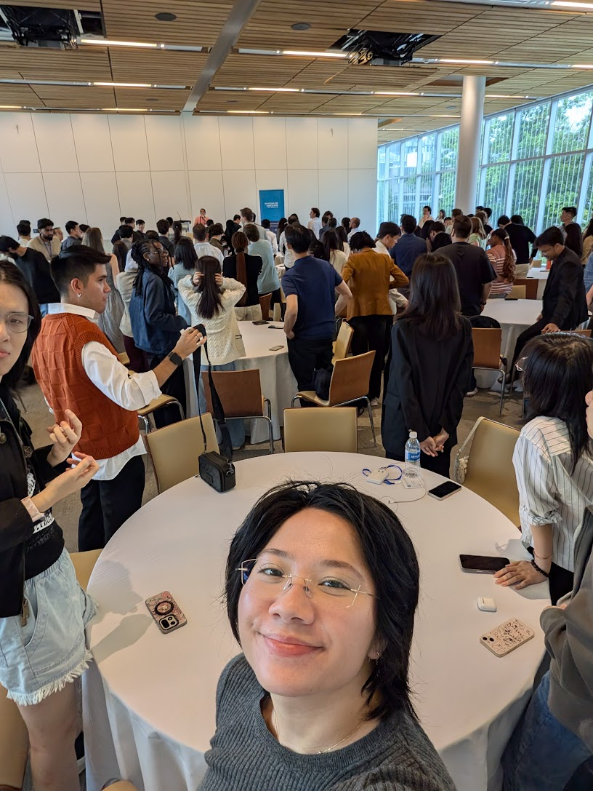

Moving all the way from Philly to Vancouver was a bit of a whirlwind, but orientation week made the move a lot easier. Stepping onto campus, taking in the mountain views, and meeting everyone in the cohort made me super excited to dive in.

Classes definitely didn’t waste any time! We jumped straight into Bash, Git, Python, and R on day one. Coming from an economics background where everything was spreadsheets, living in the terminal was a little intimidating at first, but it felt great once the commands finally started clicking.

Now that the initial rush has settled down, I’m really looking forward to the rest of the term. The cohort is great, and working through tough labs together makes the fast pace a lot more fun. I can’t wait to see how much we learn over the next few months!