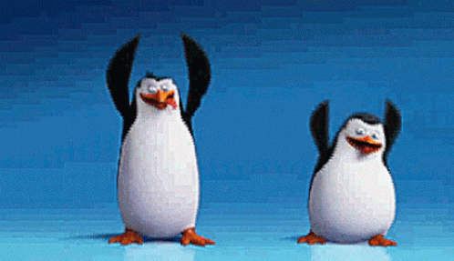

{fig-align="center"}

## Introduction

We have done a lot of work in DSCI 523 using `palmerpenguins` dataset. I wanted to see how the `body_mass` (g) of these penguin `species` (Adelie, Chinstrap and Gentoo) changed over the `year` (2007 - 2009).

**Data source**: [Palmer Penguins](https://allisonhorst.github.io/palmerpenguins/), Palmer Station Antarctica LTER.

## Setup & Data Ingestion

Please load the required Python libraries below.

```{python}
#| label: setup-python
#| message: false
#| warning: false

import pandas as pd
import matplotlib.pyplot as plt
from palmerpenguins import load_penguins

penguins = load_penguins()
penguins.head()
```

## Body Mass Summary by Species

From `annual_mass` we can observe that Gentoo penguins are the significantly heavier than the other species across all years.

```{python}
#| label: average-penguin-mass
#| fig-cap: "average body mass (g) of penguin by species and year"

# clean raw penguins data by indexing relevant columns and removing rows with missing values (using .dropna)
clean_penguins = penguins[["species", "year", "body_mass_g"]].dropna()

# get average mass (using group.by) for species by year, get mean (.mean) and round to/display whole number
average_mass = clean_penguins.groupby(["species", "year"])["body_mass_g"].mean().round(0).astype(int)

# return average-penguin-mass
average_mass.reset_index()
```

## Reshaping for Yearly Comparison

New observations from the `average_mass_table`: Adelie's and Chinstrap's average mass rose from 2007 -\> 2008, peaked in 2008 and then feel from 2008 -\> 2009. Gentoo didn't follow this trend, instead falling between 2007 -\> 2008 and then rising from 2008 -\> 2009 (peaking in 2009).

```{python}
#| label: unstack-average-mass
#| fig-cap: "comparsion of average body mass (g) for each species over the given years"

# unstack (using .unstack) the year index into columns
average_mass_table = average_mass.unstack(level = "year")

# clears "year" label on table
average_mass_table.columns.name = None

# return 
average_mass_table
```

## Descriptive Statistics

New observations (and what they imply) from species_stats: Adelie's standard deviation (459g) is the lowest of all species, indicating their data set has the least range of recorded weights. Chinstrap have nearly half the observations (68) either other species have (151 and 123); due to the observation count, Chinstrap have slightly smaller confidence intervals than Adelie (whom they share a 50% confidence interval with). Gentoo's mean (5075g) is higher than the max of the other species (4775g and 4800g), implying that the average Gentoo penguin is more massive than the largest Adelie or Chinstrap.

```{python}
#| label: descriptive-stats
#| fig-cap: "statistics to help examine overall distribution of mass"

# for each species get the summary statistics (.describe) using mass, round to 0 decimals and display as whole number
species_stats = clean_penguins.groupby("species")["body_mass_g"].describe().round(0).astype(int)

species_stats
```

## Visualizing Body Mass Trajectories

From the graph we can see that there is a consistent gap in weights between Gentoo's and Adelie's/Chinstrap's. Additionally, each individual `species` average mass only varies slightly between each year.

```{python}
#| label: penguin-mass-trends
#| fig-cap: "average body mass (g) across Palmer Penguin species from 2007-2009."


# transpose the table so years are rows and plot each species as a line; this uses Matplotlib
ax = average_mass_table.T.plot()
# sets title
plt.title("Mean Body Mass by Species (2007–2009)")
# sets x-axis label
plt.xlabel("Observation Year")
# sets y-axis label
plt.ylabel("Mean Body Mass (g)")
# forces observation year to display only real years
plt.xticks([2007, 2008, 2009])
# give us the graph!
plt.show()
```

{fig-align="center"}